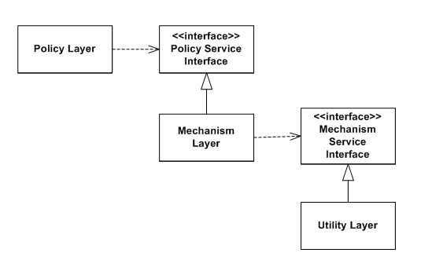

```
// ~~~~~~~~~~~~~~~~~~~~~~~~~~~~~~~~~~~~~~~~~~~~~ //
//                Journey to Dev!                //
// ~~~~~~~~~~~~~~~~~~~~~~~~~~~~~~~~~~~~~~~~~~~~~ //
```


# **Program Structure**
## *OOP Design patterns*
## *SOLID Principles*
 - Single Responsibility
   - A Class should only have a single responsibility. More intently, a given Class should only have on potential vector for change. 
 - Open/Closed
   - Software entities should be open for extension, but closed for modification. The goal should be that your source code need not be changed to allow for the addition of new features, but rather built from without changing the original.
 - Liskov Subsititution
   - If an object 'S' is a subtype of another object 'T', then any objects of type 'T' should be able to be replaced with objects of type 'S'.
 - Interface Segregation
   - Many client-specific interfaces are better than one general-purpose interface, allowing for no client to need to depend on methods that it does not use. Smaller, more specific interfaces allow for a client to need to only know about methods that are of interest to them.
 - Dependency Inversion
   - The goal of Dependency Inversion is to decouple all reusable bits from one another, both low-level and high-level. More formally:
     - High-level modules should not depend on low-level modules. Both should depend on abstractions.
     - Abstractions should not depend on details. Details should depend on Abstractions.
     - 
## *DRY* (taken further)
@More-Acronym-soup..
@More..
 
# **Basic/Foundational Tools**
 - OOP Concepts
   - Encapsulation
   - Polymorphism
 - Decorators
 - Generators
 - Docbook/PyDoc (or some other documentation comments)
@Other - Brandon said that people will often keep a list of "does a given language support these tools..". See if you can find some of those, and/or construct a list from looking at low->high level languages' documentation.
   
# **Processes**
 - TDD
 - BDD (less so)
 - Scrum / Kanban
 - Continuous Integration
 - Continuous Deployment
 - Strangler (Soapbox)
@Other..
 
# **Developer Tools**
 - Git
   - Develop -> Master / Deploys workflow
     - API before nas2 and stuff?
 - Debian Packages
 - Diff/Patch
 - Vagrant
 - Jenkins
 - Ansible
 @Other..
 
# **Language Familiarity / Readability**
## *PHP*
 - Common Quirks
 - OOP Syntax
 - Every type of loop and iterator
 - Callbacks?
 - @More..
 
## *Python*
 - Common Quirks
 - OOP Syntax
 - Every type of loop and iterator
 - Callbacks?
 - @More..
 
## *SQL*
 - Common Quirks
 - Examining query efficiency
 - @More..

# **Data Structures**
## List
## Associative List
## Set
## Map (HashMap)
## Hash
## Tree
@Other..

# **Core Algorithms**
## *Algorithm Efficiency*
### Big O
@Other..

## *Search Algorithms*
### Binary Search
@Other..

## *Sort Algorithms*
### Insertion Sort
### Quick Sort
### Merge Sort
With a Big(O) of `n•log2(n)+n` Merge Sort is a particularly efficient sorting algorithm for large data sets. Merge Sort works by splitting a given input array into two sorted halves, then traversing through each element in those two arrays and placing the smaller element into your output array. It recurses through the entire array, splitting in two again and again until each element is of length 1 or 0, then simply placing each known array in sorted order.

**Psuedo Code:**

@Other..
  
## *Recursion*
@More..
